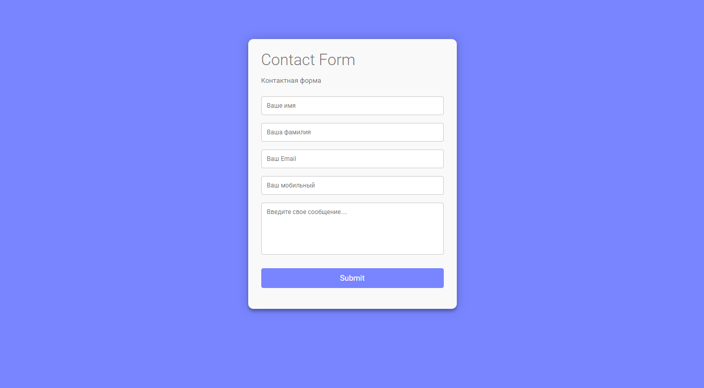

# Form send to e-mail.

The task was to create the HTML form that sends me an email.
Buy the domain and host it.

## Screenshot

### Links

- GitHub URL: [GitHub](https://github.com/wonder-filka/form-mail-sender)
- Live Site URL: [lolly-oops-shop](http://lolly-oops-shop.website/)

## My process

### Built with

- HTML5
- CSS3
- PHPmailer
- ES6 - JS

## Author

- Website - [Iryna Filonova](https://sensational-cactus-93a152.netlify.app/)
- Twitter - [@filochka2](https://twitter.com/filochka2)
